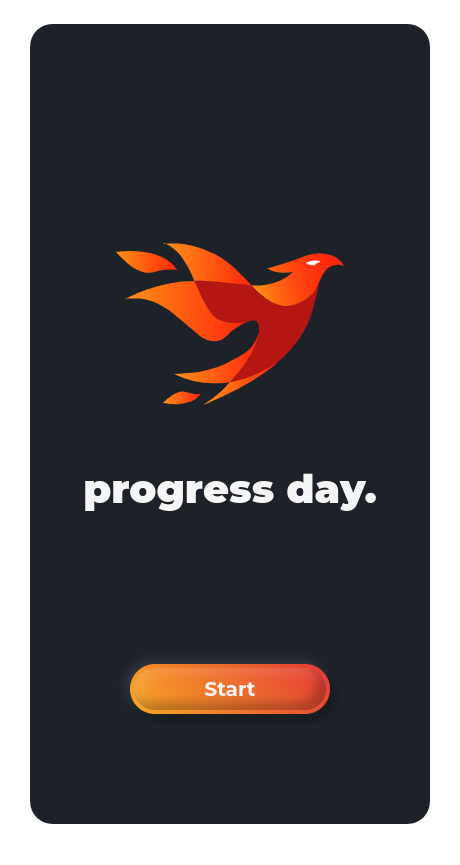
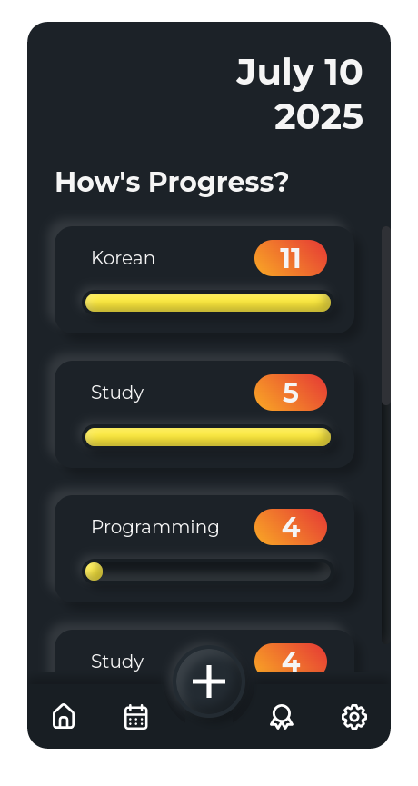

# ProgressDay

<div align="center">
  
  
</div>

ProgressDay is a modern productivity app focused on helping users build habits and track their progress over time. While its core is a habit tracker, ProgressDay is designed to grow into a comprehensive productivity suite, with planned features such as analytics, achievements, and social interaction with friends.

## Prerequisites

- [Node.js](https://nodejs.org/) (v18 or newer recommended)
- [pnpm](https://pnpm.io/) (v8 or newer recommended)

## Features

- **Habit Tracking:** Easily create, manage, and track daily habits.
- **Progress Visualization:** Animated progress bars and streaks to keep you motivated.
- **State Management:** Powered by [Zustand](https://github.com/pmndrs/zustand) for fast and simple state management.
- **Smooth Animations:** Uses [react-spring](https://www.react-spring.dev/) for fluid UI transitions.
- **Electron Desktop App:** Built with [React](https://react.dev/), [Vite](https://vitejs.dev/), and [Electron](https://www.electronjs.org/) for a fast, cross-platform desktop experience.
- **WebSocket Communication:** Connects to a separate backend server for real-time updates and data sync.


## Planned Features

- **Analytics:** Visualize your productivity trends and habit consistency.
- **Achievements:** Unlock badges and rewards for reaching milestones.
- **Social:** Add friends, share progress, and motivate each other.


## Tech Stack

- **Frontend:** React + TypeScript + Vite
- **Desktop:** Electron
- **State Management:** Zustand
- **Animation:** react-spring
- **Communication:** WebSockets (to backend server)


## Getting Started

1. **Install dependencies:**
   ```sh
   pnpm install
   ```
2. **Start the app in development mode:**
   ```sh
   pnpm dev
   ```
3. **Build for production:**
   ```sh
   pnpm build
   ```


## Scripts

See [`package.json`](package.json) for all available scripts.


## Contributing

Contributions are welcome! Please open issues or pull requests for suggestions and improvements.


## License

MIT License. See [LICENSE](LICENSE) for details.

## Author

Nicholas Chai

## Credits

- [React](https://react.dev/)
- [Vite](https://vitejs.dev/)
- [Electron](https://www.electronjs.org/)
- [Zustand](https://github.com/pmndrs/zustand)
- [react-spring](https://www.react-spring.dev/)
